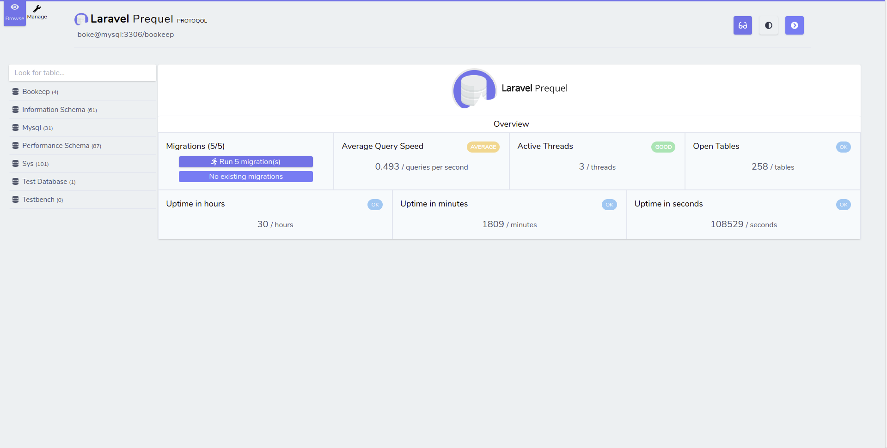

# Laravel Prequel 0.5.0-beta #
[](https://packagist.org/packages/protoqol/prequel)
[](https://packagist.org/packages/protoqol/prequel)
[](https://packagist.org/packages/protoqol/prequel)

#### What is Laravel Prequel exactly? ####
Laravel Prequel is meant to be a database management tool to replace the need for separate standalone database tools like phpMyAdmin, Sequel Pro or MySQL Workbench. With its (hopefully) clear and concise UI, Prequel is to be a modern and lightweight database browser/tool ready for the web of the future. Prequel's design is purposefully based on that of [Laravel Telescope](https://github.com/laravel/telescope) because (web-)developers today have enough to learn and master already, so let's help eachother out and make sure to not add anything virtually useless to that huge pile of knowledge. 


> Clear and concise database management

#### Laravel Prequel (Beta) ####
Laravel Prequel has entered v0.5.0-beta, that means I deemed it ready enough to be tested by the public.
But note that a beta release is still a beta release and is not a stable release so it is definitely not recommended to be used in production environments. 

Luckily, Prequel has taken precautions, Prequel automatically disables itself in a production environment as people looking directly into your database is - let's just say - not ideal.


### Installation (the beta release way)
```
$ composer require protoqol/prequel
$ php artisan vendor:publish --tag=config
$ php artisan vendor:publish --tag=public
```
### Docs - coming soon!
